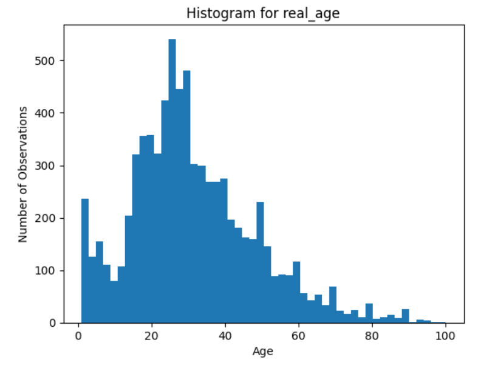
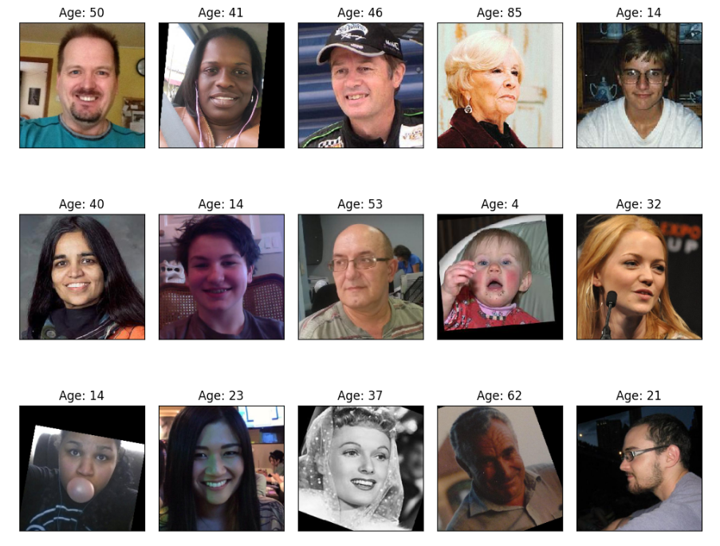

# Sprint 15 Project: Computer Vision
 
---

### 📚 Table of Contents
- 🔍 [Project Overview](#project-overview)
- 📈 [Conclusion](#conclusion)
- 🖼️ [Sample Outputs](#sample-outputs)
- 📁 [Files](#files)

---

## Project Overview

The supermarket chain Good Seed would like to explore whether Data Science can help them adhere to alcohol laws by making sure they do not sell alcohol to people underage. You are asked to conduct that evaluation, so as you set to work, keep the following in mind:
- The shops are equipped with cameras in the checkout area which are triggered when a person is buying alcohol
- Computer vision methods can be used to determine age of a person from a photo
- The task then is to build and evaluate a model for verifying people's age

To start working on the task, you'll have a set of photographs of people with their ages indicated.

---

## Conclusion

The purpose of this project was to develop a computer vision model that could help the Good Seed supermarket chain avoid selling alcohol to underage people.

The model was trained on 7.5 thousand images from the ChaLearn face dataset, which contained an appropriately diverse set of photos ranging in age from 1 to 100 with a mean of 31. I evaluated a relatively simple model with a ResNet50 backbone, global average pooling, and a single dense regression layer. It performed well overall. The training metrics decreased consistently over 20 epochs and the validation metrics decreased for about half of the epochs before plateauing and rebounding toward the end. The final model showed signs of overfitting and should probably be trained with fewer epochs or early stopping. The best Mean Absolute Error obtained was 6.64 years and the final score was 7.65 years.

Although the model improved over the course of training and performed adequately, its practical value was unclear. With the goal of accurately determining whether someone is at least 21 years old, a margin of error around 7 years is awfully high. Implementing a simple threshold of 21 years for alcohol purchases would lead to many violations of the law. Examining the distribution of errors and plotting false positive rates could shift the threshold to help reduce legal violations, but it would need to be quite high (likely greater than 28) to prevent most underage purchases. The age of customers who appear younger would need to be manually checked. Even if the threshold were 30 or 35, significant time and effort could be saved by avoiding manual age checks for anyone older. That said, this model cannot provide a simple, foolproof way to guarantee automated compliance with the law. Its value as a tool must be balanced with equipment and implementation costs.

I think it would make more sense to train a model devoted specifically to classifying adults older than 21 years old. A binary classification task is more directly applicable to Good Seed's goals and can be better tuned to avoid breaking the law. Classifiers can be trained to avoid costly false positives (apparent adults who are underage) and they offer probability estimates that could be used to trigger manual age checks. Either way, neither a regression nor a classification model is likely to perform as well with supermarket camera photos as it does on the ChaLearn dataset. Good Seed will probably need to invest in high-fidelity cameras and upgraded lighting in any participating store. The model should also be trained at least in part on photos taken in realistic conditions at the stores. Practical performance could be substantially improved by using even a few hundred manually labeled photos to fine-tune part of a model pretrained on ChaLearn data.

The regression model might be worth retaining for other applications. It could as easily enforce age-based restrictions on tobacco, lottery tickets, medicine, and other items as on alcohol. It could also automatically offer senior or student discounts. Going even further, the model could suggest promotions or products based on age, either in person or as coupons embedded in receipts. Such recommendations could be derived or at least improved by integrating purchase data with model-based age estimates. Those data could also be invaluable for customizing each store's ordering, stocking, and marketing decisions based on demographics. It is important to consider potential legal issues with any computer vision application. Privacy must be maintained when storing and processing personal information and images. Care should also be taken to avoid discrimination by ensuring models perform comparably for people with different skin tones, facial features, makeup, clothing, etc.

I believe that computer vision can help Good Seed in several ways. With the right equipment, specification, and training data, a model much like the one in this project can help avoid selling alcohol to underage customers, even if it cannot offer a comprehensive or foolproof solution. Such a model probably cannot replace manual age verification entirely, but it can significantly reduce it. The value of that help must be weighed against the cost of upgrading equipment, training the model, and implementing it widely. The potential for enforcing other laws, offering relevant promotions, and collecting demographic data might help further offset costs. I cannot definitively determine if that investment is worthwhile without more information, but I tentatively recommend that Good Seed continue to explore computer vision.

---

## Sample Outputs

Here are two key moments from the analysis:

  
*Age distribution of the dataset. Most faces fall between ages 10 and 40, with far fewer older or very young individuals represented.*

 

  
*Sample of input images with corresponding real ages. The model learns to predict age directly from these face photos.*

---

## Files

📄 See the full analysis in [`sprint-15-project.ipynb`](./sprint-15-project.ipynb)  
📄 Or view a static version in [`sprint-15-project.html`](./sprint-15-project.html)  
📄 Project background: [`project-description.md`](./project-description.md)

> Note: This project uses one dataset consisting of a CSV file and a folder with thousands of images.  
> The dataset was omitted from the `/data/` folder due to GitHub file size limits.  
> See [`/data/README.md`](./data/README.md) for details.

